# Project Description

## 1. Project Overview

- **Project Name:** Pirate Escape
- **Project by:** Mr.Theewasu

**Brief Description:**
Pirate Escape is a top-down endless runner game built with Python and pygame. The player steers a pirate boat through 5 ocean lanes, dodging rock obstacles, collecting gold coins, and evading police patrol boats. The game is inspired by the endless runner genre popularized by **Subway Surfers** — bringing the same addictive "dodge and collect" loop to a naval setting with a pirate theme. The longer the player survives, the faster the boat moves, making each run progressively more challenging.

Beyond the core gameplay, the game features a boat shop with 4 unique vessels (each with different abilities and customizable colors), a persistent coin wallet, powerups, a police chase mechanic, and a built-in data analytics page that records and visualizes session statistics across three graphs.

- **Problem Statement:** Casual games that are fun to play repeatedly but also provide meaningful data feedback are rare in the student project space. This project combines an engaging arcade game with real data recording and visualization, making every session both fun and analytically trackable.

- **Target Users:** Students and casual gamers who enjoy quick-play arcade games. Also suitable for demonstrating Python OOP and data visualization concepts.

- **Key Features:**
  - 5-lane endless runner with progressive speed scaling
  - Police chase mechanic (crash twice in 10 seconds = game over)
  - 4 purchasable boats with unique abilities and color customization
  - 4 powerup types: Shield, Speed Boost, Coin Magnet, Double Coins
  - Combo system for chained coin collection
  - Persistent wallet and garage (data carries over between sessions)
  - Built-in data analytics page with 3 graphs
  - Leaderboard (top 10 scores)
  - Background music and procedural SFX with volume controls

**Screenshots:**

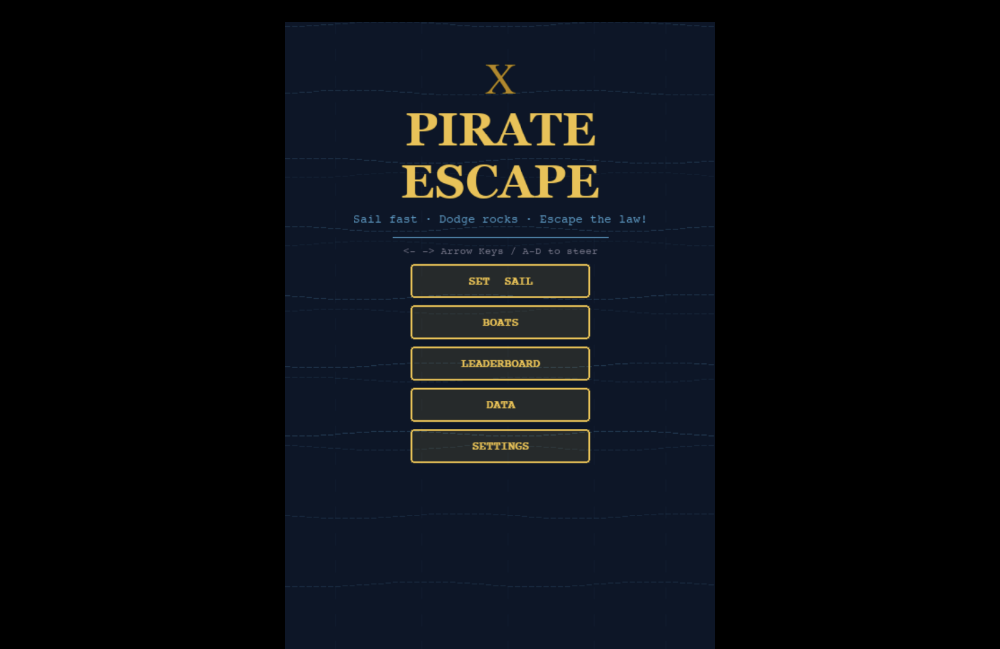
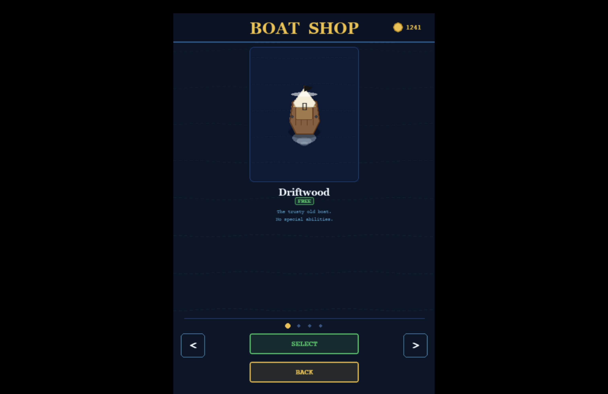
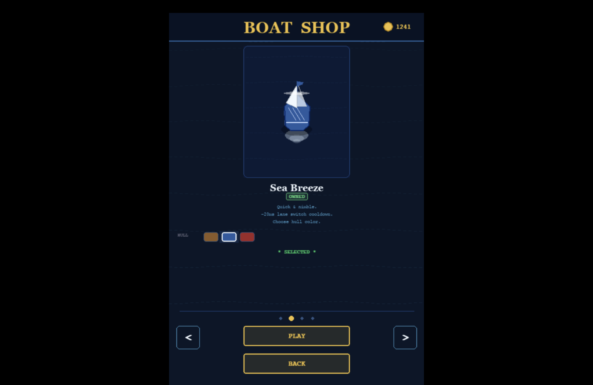
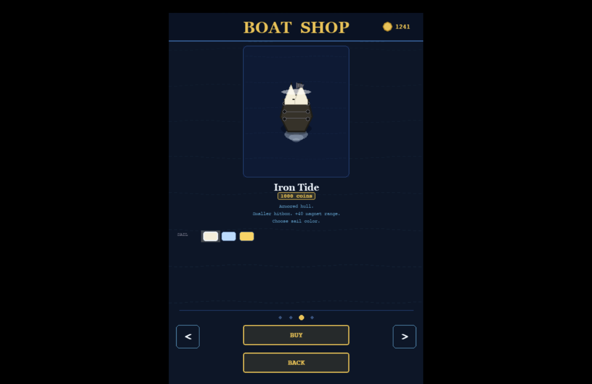
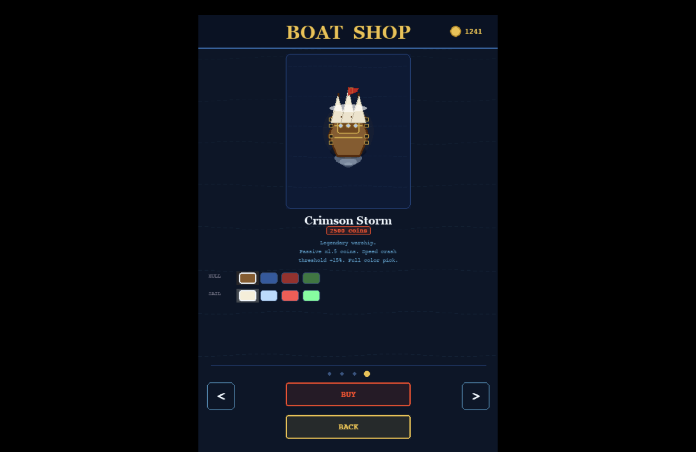
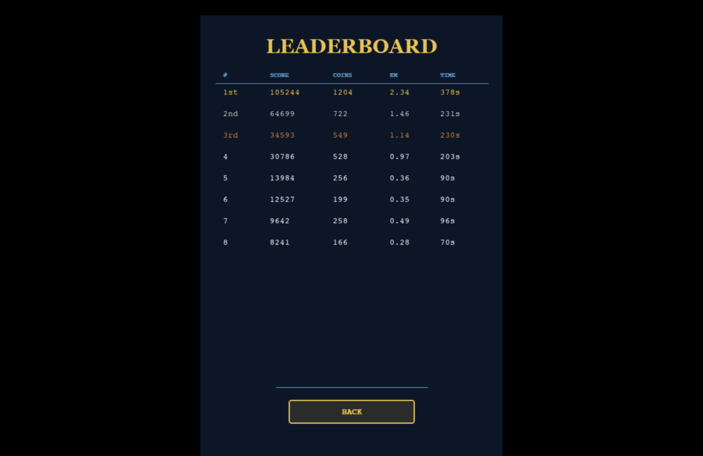
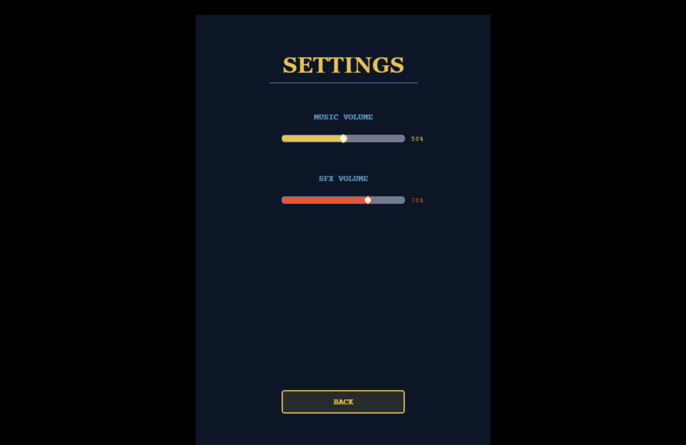
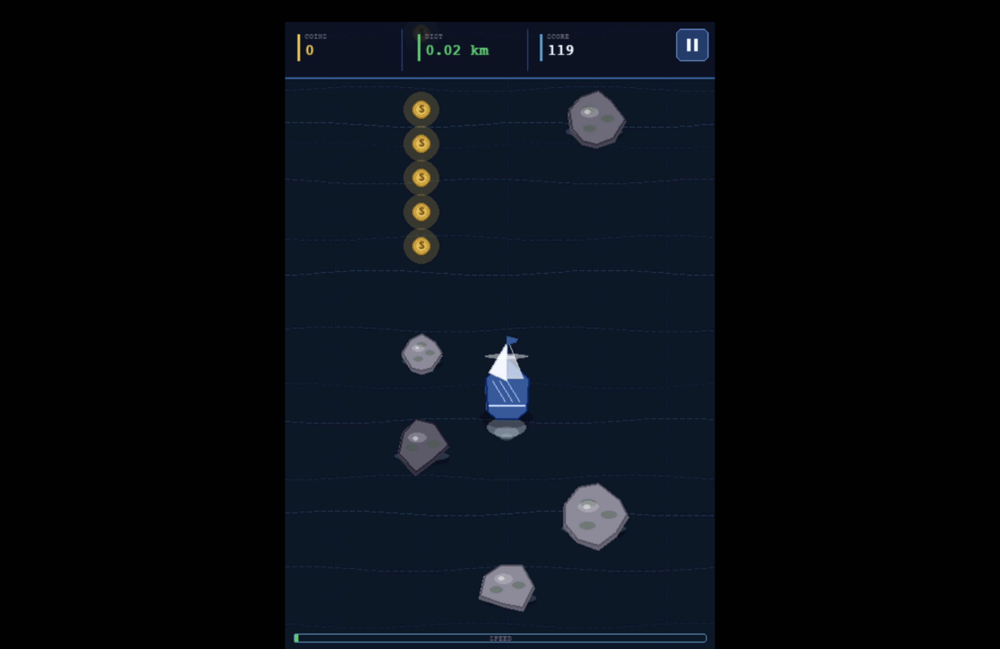
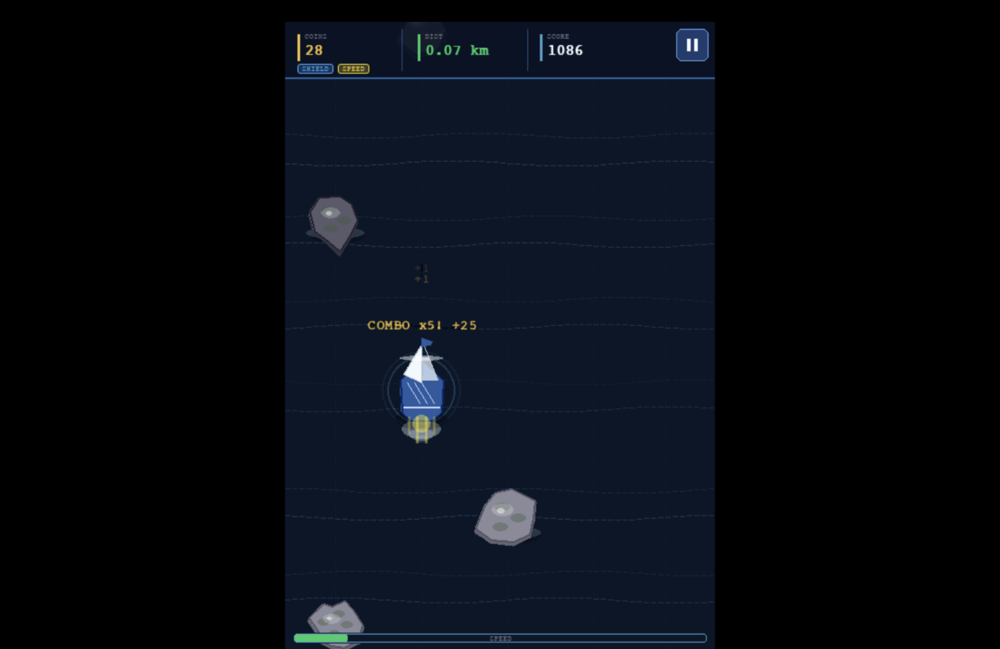
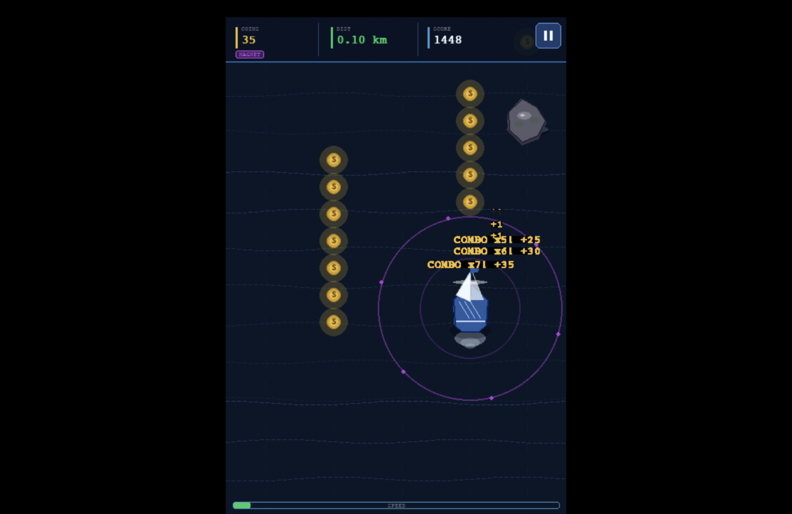
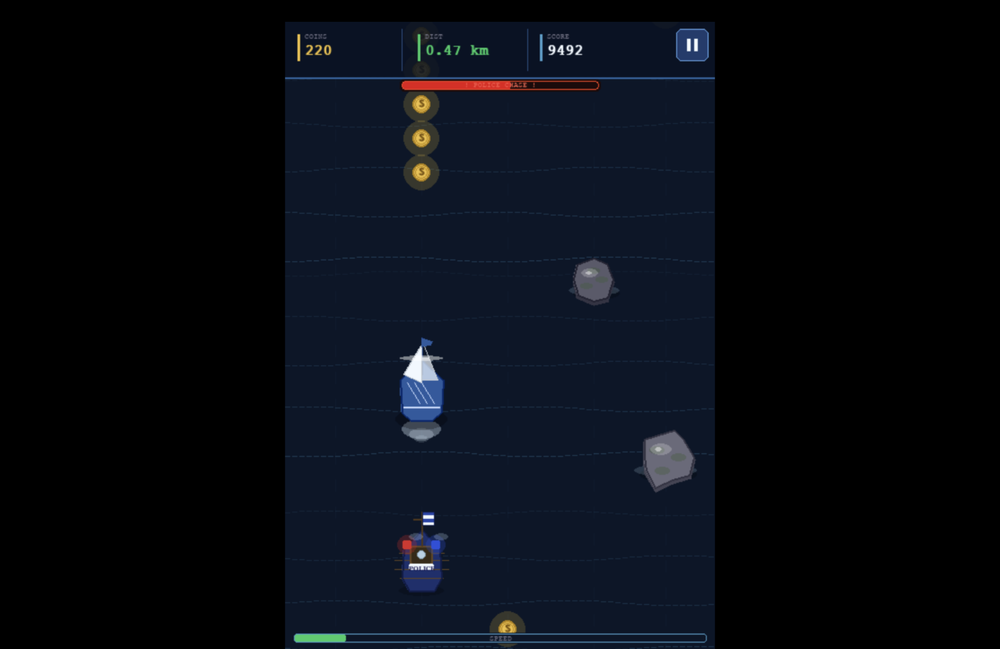
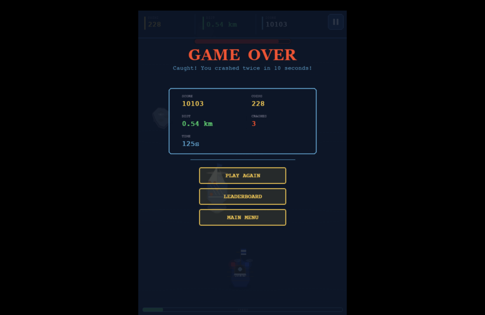

**Proposal:** https://docs.google.com/document/d/1u-aAra5HxfGTgGCPR-e61_T4upWGBjCKWuXInW_ujAw/edit?tab=t.0#heading=h.b5lykl8ymu1n

**YouTube Presentation:** *(NOT DONE IT YET.)*

---

## 2. Concept

### 2.1 Background

This project exists as a creative take on the classic endless runner formula, re-skinned into a pirate ocean escape narrative. The idea was inspired by **Subway Surfers** — a mobile game where the player runs endlessly, dodging obstacles and collecting coins while being chased by authority figures. Translating this concept to a top-down boat game adds unique mechanics: lane-based movement on water, a police pursuit system with a timed window, and a boat upgrade economy.

The pirate theme was chosen for its strong visual identity — wooden boats, gold coins, ocean waves, and police ships create a coherent and visually interesting world that is fun to implement with pygame's drawing primitives.

### 2.2 Objectives

- Build a fully playable endless runner arcade game using Python and pygame with no external game engine
- Implement an OOP-based architecture where each game entity (boat, obstacle, coin, particle, police) is its own class
- Provide a progression system (coin economy, boat shop, leaderboard) that gives players a reason to keep playing
- Automatically record session data and display it as meaningful visualizations (histogram, scatter plot, boxplot) using only pygame — no chart libraries
- Demonstrate clean separation of concerns: game logic, UI rendering, and data recording in separate modules

---

## 3. UML Class Diagram

The UML class diagram is attached as a PDF in this repository.

**Classes and relationships overview:**

- `GameManager` — central controller; owns all game objects and the state machine
- `PlayerBoat` — player-controlled boat with ability modifiers from `BOAT_BY_ID`
- `Obstacle`, `Coin`, `Powerup` — lane-based game objects that scroll downward
- `PoliceBoat` — special object that tracks player X position after arriving at patrol row
- `ParticleSystem` — manages `Particle`, `ShardParticle`, `ShieldRing`, `FloatingText` effects
- `SoundBank` — procedural SFX container; gracefully no-ops if numpy unavailable
- `SessionData`, `LeaderboardEntry` — data classes for persistence (via `data_recorder`)

*(UML PDF)(NOT DONE YET.)*

---

## 4. Object-Oriented Programming Implementation

- **`GameManager`** (`game/game_manager.py`) — State machine controller. Manages the game loop, all spawning, collision detection, scoring, police chase logic, and transitions between all game states (menu, playing, paused, game over, boat shop, settings, leaderboard, data page).

- **`PlayerBoat`** (`game/player_boat.py`) — Represents the player's vessel. Reads ability data from `BOAT_CATALOG` to apply stat modifiers (hitbox shrink, move cooldown reduction, magnet radius bonus, coin multiplier, speed threshold bonus). Contains powerup timers and draws itself using one of four boat-specific draw functions.

- **`Obstacle`** (`game/objects.py`) — Rock obstacle with procedurally generated polygon shape and layered visual rendering (shadow, foam ring, moss patches, specular highlight).

- **`Coin`** (`game/objects.py`) — Collectible coin with magnet attraction logic. Responds to the player's magnet powerup by drifting toward the player.

- **`Powerup`** (`game/objects.py`) — One of four powerup types (shield, speed, magnet, double coins), each with unique color and icon.

- **`PoliceBoat`** (`game/objects.py`) — Vintage police vessel. Enters from the bottom of the screen and then smoothly tracks the player's X position to create pressure.

- **`ParticleSystem`** (`game/particles.py`) — Manages all visual effects. Contains inner classes: `Particle` (circular burst), `ShardParticle` (spinning triangle shard), `ShieldRing` (expanding ring on shield break), `FloatingText` (rising score/message text).

- **`SoundBank`** (`game/sounds.py`) — Synthesizes all SFX procedurally using numpy waveforms. Gracefully disables itself if numpy is unavailable.

- **`SessionData`** / **`LeaderboardEntry`** (`data/data_recorder.py`) — Dataclasses for structured session recording and leaderboard storage. All persistence handled via CSV and JSON files.

---

## 5. Statistical Data

### 5.1 Data Recording Method

Data is recorded automatically at the end of every game session. Two files are maintained:

- **`game_stats.csv`** — appended with one row per session containing: `score`, `time_played`, `distance`, `coins_collected`, `collisions`, `level_reached`
- **`collision_speeds.csv`** — appended with the boat's speed at the exact moment of each rock collision

Leaderboard and wallet/garage data are stored in JSON files (`leaderboard.json`, `wallet.json`, `garage.json`).

### 5.2 Data Features

| Feature | Type | Description |
|---|---|---|
| `score` | Integer | Total score accumulated during the session |
| `time_played` | Integer (seconds) | Duration of the session |
| `distance` | Float (km) | Total distance travelled |
| `coins_collected` | Integer | Total coins picked up |
| `collisions` | Integer | Number of rock collisions |
| `speed_at_collision` | Float | Boat speed at each crash moment |

**Three visualizations are displayed on the DATA page:**
1. **Histogram** — Distribution of `time_played` across all sessions (8 bins)
2. **Scatter Plot** — `distance` vs `coins_collected` per session
3. **Boxplot** — Distribution of `speed_at_collision` (Q1, median, Q3, outliers)

---

## 6. Changed Proposed Features

- The original three-level structure was removed so that the game can run continuously, ensuring longer gameplay and preventing it from ending too quickly.

---

## 7. External Sources

1. Background music: *Pirate1_Theme1.mp3* — by Olivier Bérubé, License: GPL 3.0, from https://opengameart.org
2. **pygame** library — https://www.pygame.org — License: LGPL 2.1
3. **numpy** library — https://numpy.org — License: BSD
