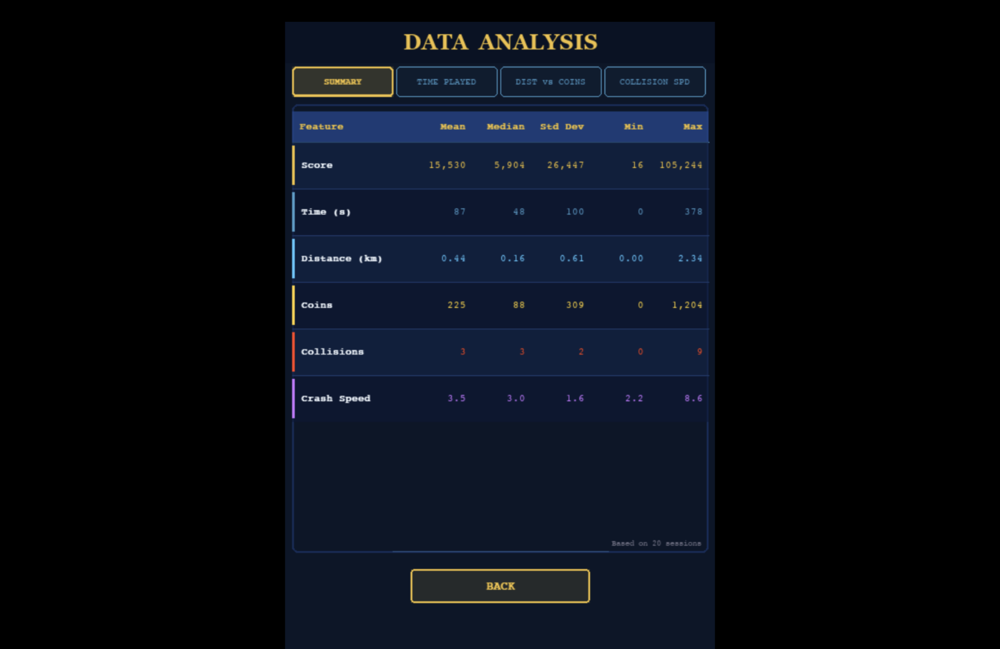
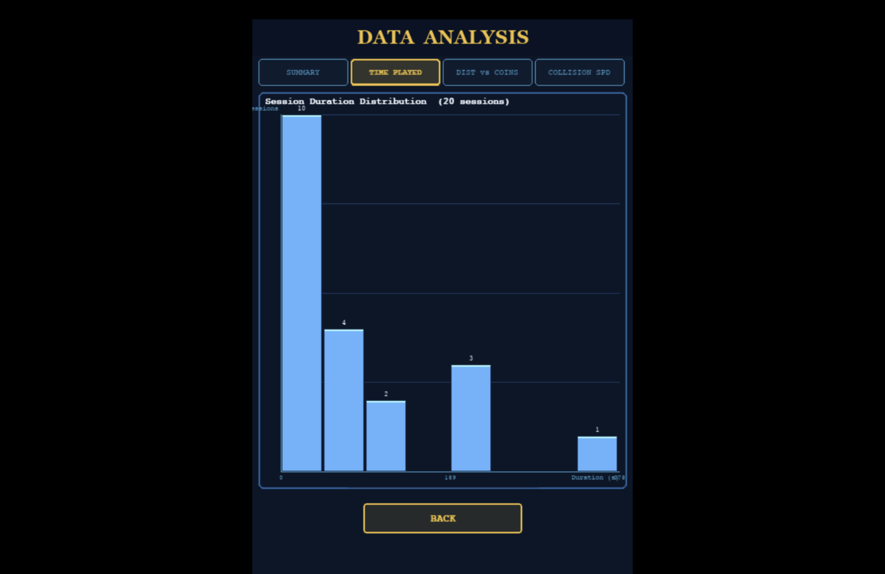
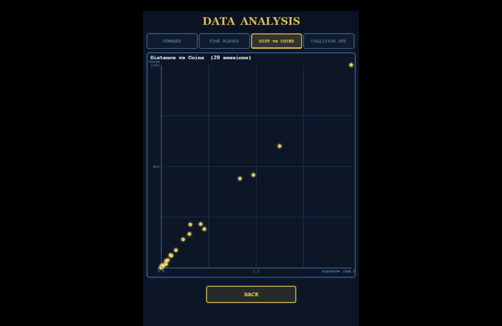
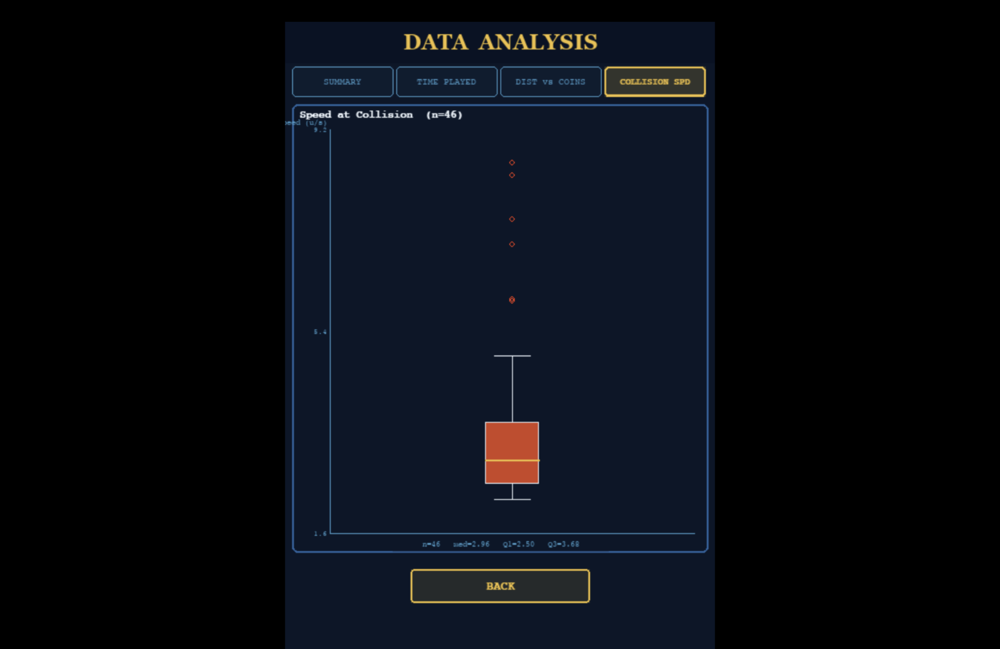

# Data Visualization

This page documents the data collection and visualization features of Pirate Escape.

---

## Overview

The game records statistics for every play session automatically.
All data is stored locally in CSV and JSON files:

- `game_stats.csv` — per-session data (score, time, distance, coins, collisions)
- `collision_speeds.csv` — boat speed at the moment of each collision
- `leaderboard.json` — top 10 high scores

The in-game **DATA** page displays three graphs built entirely with pygame (no external charting library).

---

## Data Page Overview

> **

The data page shows a summary row at the top (Mean, Median, Max, Min, SD of score across all sessions),
followed by three graphs stacked vertically.

---

## Graph 1 — Time Played Distribution (Histogram)

> **

**What it shows:** Distribution of time played (in seconds) across all recorded sessions,
divided into 8 bins.

**Why it is useful:** Reveals how long players typically survive. A right-skewed distribution
indicates most sessions are short, while a spread distribution suggests varied skill levels.
Each bar is labelled with its frequency count.

---

## Graph 2 — Distance vs Coins Collected (Scatter Plot)

> **

**What it shows:** Each dot represents one play session — x-axis is distance travelled (km),
y-axis is total coins collected.

**Why it is useful:** Shows the correlation between how far a player sailed and how many coins
they earned. A positive trend confirms that longer runs reward more coins. Outliers (high coins
but short distance) can indicate effective use of the coin magnet powerup.

---

## Graph 3 — Boat Speed at Collision (Boxplot)

> **Screenshot:** `graph3_boxplot.png`
> **

**What it shows:** A boxplot of the boat's speed (units/second) at the exact moment each
collision with a rock occurred. Shows Q1, median, Q3, whiskers, and outliers.

**Why it is useful:** Reveals at what speed players tend to crash. If the median collision
speed is high, it suggests players crash because the game became too fast to react to,
rather than due to poor steering. Outliers at very high speeds indicate experienced players
who pushed the speed limit.

---

## Data Collection Method

Session data is recorded automatically at the end of every game via `data_recorder.py`:

```python
save_session(SessionData(
    score, time_played, distance, coins_collected, collisions, level_reached
))
```

Collision speed is logged separately at the moment of each crash:

```python
save_collision_speed(current_speed)
```

All data is appended to CSV files so historical data accumulates across sessions.
